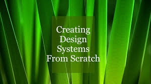

<h1 align="center">Implement a design from scratch</h1>

    

## Description

In this project, you will implement from scratch, without any library, a web page. You will use all HTML/CSS/Accessibility/Responsive design knowledge that you learned previously.

You won’t have a lot of instructions, you are free to implement it the way that you want - the objective is simple: Have a fully functional web page that looks the same as the designer file.

## Requirements

- You are **not** allowed to import external CSS frameworks (like Bootstrap).
- You are **not** allowed to use JavaScript.
- The page must be fully responsive and accessible.
- The HTML and CSS must be well-structured and cleanly written.
- The final implementation must match the provided design as closely as possible.

## Tools & Technologies

- **HTML5** for structuring the content.
- **CSS3** for styling and layout.
- **Flexbox & Grid** for responsive design.
- **Media Queries** to adapt to different screen sizes.
- **Lighthouse** for testing accessibility and performance.

## Author

Project realized by **Hammache Haris** as part of mastering HTML, CSS, and responsive design concepts.